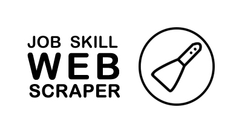

<!-- PROJECT LOGO -->
<br />
<p align="center">
  <a href="https://github.com/othneildrew/Best-README-Template">
    
  </a>

  <h3 align="center">Intelligent Job Scrapper</h3>

  <p align="center">
  This project crawls and scraps Canada's most popular job posting websites to see what skill are associate with your a specific technology-based job.
    <br />
    <br />
   Note: This project was reposted from the original repository. This was a collaborative project and I did not build it alone.
   <br />
    <br />
  </p>
</p>


<!-- TABLE OF CONTENTS -->
## Table of Contents
* [About The Project](#about-the-project)
* [Getting Started](#getting-started)
  * [Prerequisites](#prerequisites)
  * [Setup](#setup)
	  *  [Server](#server)
	  * [Web Client](#web-client)
 * [Usage](#usage)
* [Contributors](#Contributors)
* [Contact](#contact)


<!-- ABOUT THE PROJECT -->
## About The Project


**Note:** *This repository is a **duplicate** of the original project. I decided to duplicated so I could have more control over the read-me file you are reading now. Please acknowledge that [guzbandu](https://github.com/guzbandu) and [sahajarora1286](https://github.com/sahajarora1286) both contributed in making this awesome project a reality. If you want to see the original please check it out [here](https://github.com/guzbandu/comp4601-Project).*

This project crawls a handful of job posting websites that are popular in Canada and, provided a job title term like: 'Database Engineer' or 'Data Scientist' scraps relevant job posting to see what are the top skills that are currently popular with said job. 

This project is a **fullstack project** as it implements a REST back-end and front-end system.

As a recent computer science grade, I thought this project was really useful because it seems every company has a different preference of technologies to master so understanding what skills are appreciated across multiple industries is really helpful. 


<!-- GETTING STARTED -->
## Getting Started

This project was developed with Java and a slew of other technologies. Please Follow the instructions bellow carefully to download and run the project. If you have any issues please feel free to email me at daschko.l@gmail.com . I would be happy to help or fix any issues you run into.

### Prerequisites

Here the things you need to run the code:
* Java 8
```sh
npm install java
```

* Maven
```sh
npm install maven
```
* Ionic and Cordova
```sh
npm install -g ionic cordova
```
 * Node.js 8.4: [download](https://nodejs.org/en/blog/release/v8.4.0/)
 
* MongoDB : [download](https://www.mongodb.com/download-center/community)

* Studio 3T: [download](https://studio3t.com/download/)

* Eclipse Neon: [download](https://www.eclipse.org/neon/)


### Setup
#### Server
1. Clone the repo
```sh
git clone https://github.com/LukeVibes/PopularMusicAI
```
2. Download all the prerequisite goodies.
3. Open project with Eclipse Neon 
4. Right click the project then choose Maven -> Update Project before running the project 
5. From the Web perspective click on the Servers tab, select Tomcat v7.0 and right click. Choose the add and remove... menu option. Be certain that the COMP4601-Project is added to the server.
6. Start the server

#### Web Client
Awesome, next step is running the Web Client! To do that:
1.  In the terminal, navigate to the root of this project (/ProjectClient/project), and run the following command to download the required modules: 
```sh
npm install
```
2. In the terminal, navigate to the root of this project (/ProjectClient/project), and run the bellow command to launch this app in a browser. This command launches a static file server at a URL like "http://localhost:8003/index.html". Your URL might be different than this. You can check the URL in the output within the terminal.
```sh
ionic cordova run browser
```
3. To find your URL, Look for the line that reads
```sh
Static file server running @ ...
```
4.  If the app did not automatically open up in a browser, then open a browser, enter the static file server URL (obtained from the output in terminal) and hit Enter.


<!-- USAGE EXAMPLES -->
## Usage

Please follow the steps in Setup to properly have the Server and Client running before proceeding with this section.

Great, so now that you have all the good stuff running head to we front-end client website and follow the steps bellow to try-out the program!

 1. From within the web client select a skill.
 2. Click on "Find Relevant Skills (Database)" button.
 3. View the related skills and their relevance in the Chart that is presented.


<!-- CONTACT -->
## Contact

Luke Daschko - [@lukeduker](https://www.instagram.com/lukeduker/) - daschko.l@gmail.com

Project Link: [https://github.com/LukeVibes/PopularMusicAI](https://github.com/LukeVibes/PopularMusicAI)


<!-- MARKDOWN LINKS & IMAGES -->
[build-shield]: https://img.shields.io/badge/build-passing-brightgreen.svg?style=flat-square
[contributors-shield]: https://img.shields.io/badge/contributors-1-orange.svg?style=flat-square
[license-shield]: https://img.shields.io/badge/license-MIT-blue.svg?style=flat-square
[license-url]: https://choosealicense.com/licenses/mit
[linkedin-shield]: https://img.shields.io/badge/-LinkedIn-black.svg?style=flat-square&logo=linkedin&colorB=555
[linkedin-url]: https://linkedin.com/in/othneildrew
[product-screenshot]: https://raw.githubusercontent.com/othneildrew/Best-README-Template/master/screenshot.png
